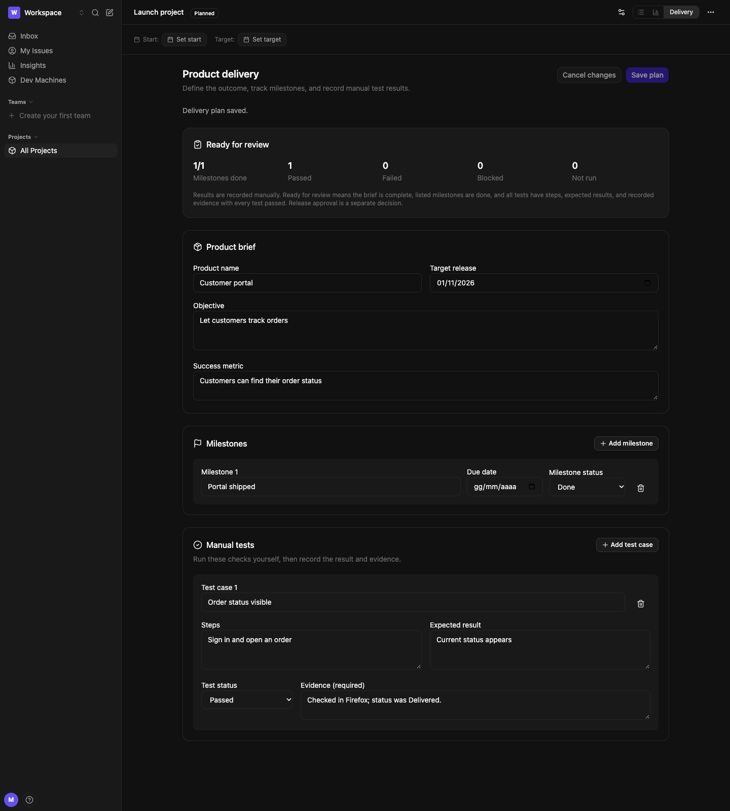

<p align="center"></p>

# Sprintorio

**From product idea to a tested release.**

Sprintorio is a self-hosted workspace for projects, product planning, issues, and manual testing. Keep product goals, delivery milestones, development work, and validation evidence together. The Go API and Svelte application are available under Apache 2.0.

[Report an issue](https://github.com/metaforismo/sprintorio/issues) · [Source](https://github.com/metaforismo/sprintorio) · [Testing guide](TESTING.md) · [Changes](CHANGELOG.md)



*Example project with sample data.*

## Project delivery

Open a project and select **Delivery** to manage:

- **Product brief:** product name, objective, success metric, and target release date.
- **Milestones:** dates and planned, in-progress, or done status.
- **Manual test cases:** acceptance, regression, and accessibility starters; steps, expected results, recorded outcomes, and evidence. Search or filter larger plans. Passed and failed results require evidence.
- **Review readiness:** a conservative summary of recorded milestones and tests. An empty test plan is never considered ready. This is a planning aid, not a deployment approval or proof that automated tests passed.

Plans are stored in PostgreSQL, scoped to the workspace, and included in workspace transfers. Owners, admins, and members can edit; guests can read. Versioned saves reject conflicting edits and preserve your draft until you explicitly reload the latest version.

## Start a workspace

Create your workspace, add a team, and write the first issue. The first-use guide opens each next step and can be dismissed. Project and team forms preserve failed drafts and offer retry. Add existing registered accounts from **Settings → Members**; email invitations are not implemented.

## Other capabilities

| Area | Included |
| --- | --- |
| Work tracking | Issues, multiple assignees, priorities, deadlines, sub-issues, relationships, comments, history, templates, and triage |
| Planning | Projects, Gantt views, cycles, progress charts, and saved views |
| Collaboration | Workspaces, teams, role permissions, notifications, and real-time updates |
| Development | GitHub repository linking, branch/commit/PR activity, and configurable status transitions |
| Portability | Workspace export/import with uploaded assets and regenerated entity IDs |
| Reporting | Workspace/team overviews and issue insights |

Dev Machines are an optional subsystem for development environments and agent runs. They are disabled by default and require dedicated host configuration. See [TECHNICAL.md](TECHNICAL.md) before enabling them.

This is development software. There is no hosted service or enterprise support promise. Operators manage infrastructure, secrets, backups, monitoring, and updates.

## Run locally with Docker

Prerequisites: Docker Engine/Desktop with Docker Compose v2.

```sh
git clone https://github.com/metaforismo/sprintorio.git
cd sprintorio
cp .env.example .env
make docker-up
```

App: `http://localhost:5173`. API: `http://localhost:8080`. The example environment is for local development; replace its secrets before exposing an instance. The application applies database migrations on startup. Create your account and workspace through the UI.

## Develop on the host

Prerequisites: Go matching [BE/go.mod](BE/go.mod), Node.js 22.12+, npm, PostgreSQL 17, and Redis. Configure `.env` for your local services.

```sh
cd UI && npm ci && cd ..
cd WEB && npm ci && cd ..
make migrate-up
make dev
```

`make dev` applies migrations, then starts the Go API and Vite application. The optional marketing site runs with `cd WEB && npm run dev`; see [WEB/README.md](WEB/README.md) for its configurable public URL.

## Self-host

The [selfhosting](selfhosting/) directory provides a Compose stack with Caddy, PostgreSQL, Redis, the API, and the UI, built from this checkout.

```sh
cd selfhosting
cp .env.example .env
# Edit DOMAIN, FRONTEND_URL, POSTGRES_PASSWORD, and JWT_SECRET.
docker compose up -d --build
```

Use a domain pointing to your server for HTTPS. Back up PostgreSQL and uploaded assets separately. Workspace transfer moves a logical workspace and does not replace disaster-recovery backups. Optional Dev Machines require a separate registrable domain and the infrastructure described in [TECHNICAL.md](TECHNICAL.md).

## Verify changes

```sh
make check-brand
make test-unit
make check
make test-e2e
```

See [TESTING.md](TESTING.md) for database integration, coverage, browser tests, and the distinction between mocked UI checks and real API persistence.

## Contribute

Use an issue to describe expected behavior and a pull request with relevant verification. Do not include secrets, customer data, personal credentials, or generated build artifacts. Product planning and test tracking should remain useful without an external AI provider.

## License

[Apache License 2.0](LICENSE). Preserve the required legal notices in [NOTICE](NOTICE) when redistributing. [CHANGELOG.md](CHANGELOG.md) records modifications in this distribution.
